# 🔐 Decentralized Payroll Escrow System

<div align="center">


**A trustless, blockchain-based payroll system with automatic escrow deposits and duration-based severance protection.**

[🚀 Live Demo](https://sepolia.etherscan.io/address/0x6ed1f0625e99ce89a17e120b2c26ae98b4aba068) | [📖 Documentation](#documentation) | [🎬 Demo Video](#demo)

</div>

---

## 📋 Table of Contents

- [Problem Statement](#-problem-statement)
- [Our Solution](#-our-solution)
- [Key Features](#-key-features)
- [Architecture](#-architecture)
- [How It Works](#-how-it-works)
- [Technology Stack](#-technology-stack)
- [Smart Contract](#-smart-contract)
- [Getting Started](#-getting-started)
- [Usage Guide](#-usage-guide)
- [Future Roadmap](#-future-roadmap)
- [Real-World Applications](#-real-world-applications)
- [Team](#-team)

---

## 🎯 Problem Statement

In traditional employment systems, several critical issues persist:

1. **💸 Severance Uncertainty**: Employees terminated from jobs often face delays or disputes in receiving severance payments
2. **🤝 Trust Deficit**: No transparent mechanism to verify company solvency or payment guarantees
3. **⚖️ Power Imbalance**: Unilateral termination without proper compensation protection
4. **🌍 Cross-Border Complications**: International payments involve intermediaries, fees, and delays
5. **📊 Lack of Transparency**: Opaque payroll systems with no public auditability

### The Cost

- Employees lose financial security during transitions
- Companies face legal disputes and reputation damage
- Traditional escrow requires expensive third-party intermediaries

---

## 💡 Our Solution

**Payroll Escrow System** is a decentralized application (dApp) that creates a trustless, transparent payroll infrastructure using Ethereum smart contracts.

### Core Innovation: **Automatic Escrow + Duration-Based Severance**

When an employee is hired:

- ✅ Company automatically deposits escrow (no separate action needed)
- ✅ Funds locked in smart contract (immutable, transparent)
- ✅ Severance calculated based on actual employment duration
- ✅ Dual-confirmation termination (both parties must agree)
- ✅ Instant, automatic payment upon confirmation

---

## ⭐ Key Features

### For Employers (HR)


- 🏢 **One-Click Company Registration** - On-chain company record
- 👥 **Seamless Hiring** - Hire employees with automatic escrow deposit
- 💰 **Transparent Balance** - Real-time escrow balance visibility
- 📅 **Monthly Payments** - Automated salary distribution (30-day cycle)
- ⚙️ **Fair Termination** - Initiate termination with built-in severance

### For Employees


- 📊 **Complete Transparency** - View all employment details on-chain
- 🛡️ **Guaranteed Protection** - Severance calculated from day one
- ⏱️ **Fair Calculation** - Severance = (Daily Salary × Days Worked)
- ✅ **Dual Confirmation** - Both parties must agree to terminate
- 🔒 **Trustless System** - No intermediaries, only code

---

## 🏗️ Architecture

### System Architecture


### Data Flow


---

## 🔧 How It Works

### 1️⃣ Company Registration

```solidity
function registerCompany(string memory _companyName) external
```

HR creates an on-chain company record with:

- Company name
- HR wallet address
- Escrow balance (starts at 0)

### 2️⃣ Hiring Process (Auto-Escrow)

```solidity
function hireEmployee(
    address _employeeAddress,
    uint256 _monthlySalary
) external payable
```

**What happens:**

1. HR specifies employee address and monthly salary
2. HR sends ETH equal to salary amount
3. Contract stores employee record
4. **Escrow automatically credited** with sent ETH
5. Employee becomes active immediately

**Innovation:** No separate deposit step - escrow funded atomically with hiring!

### 3️⃣ Salary Payment

```solidity
function paySalary(address _employee) external
```

**Requirements:**

- Employee must be active
- At least 30 days since last payment
- Sufficient escrow balance

**Process:**

- Deduct salary from escrow
- Transfer to employee wallet
- Update last payment timestamp

### 4️⃣ Termination & Severance

```mermaid
flowchart TD
    A[HR/Employee Initiates] --> B{Valid?}
    B -->|Yes| C[Mark Termination Pending]
    B -->|No| D[Revert]
    C --> E[Other Party Confirms]
    E --> F[Calculate Severance]
    F --> G[Days Worked = block.timestamp - startDate / 86400]
    G --> H[Severance = monthlySalary × Days / 30]
    H --> I[Transfer Severance]
    I --> J[Deactivate Employee]
```



**Severance Calculation:**

```solidity
uint256 daysWorked = (block.timestamp - emp.startDate) / 86400;
uint256 severance = (emp.monthlySalary * daysWorked) / 30;
```

**Key Features:**

- ✅ Either party can initiate
- ✅ Other party must confirm (dual-consent)
- ✅ Fair duration-based calculation
- ✅ Automatic, instant payment

---

## 🛠️ Technology Stack

### Smart Contracts

- **Solidity 0.8.30** - Smart contract language
- **Foundry** - Development framework
- **OpenZeppelin** - Security standards

### Frontend

- **Next.js 15** - React framework
- **TypeScript 5.8** - Type safety
- **Tailwind CSS** - Styling
- **shadcn/ui** - UI components

### Web3 Integration

- **Wagmi 2.16** - React hooks for Ethereum
- **RainbowKit 2.2** - Wallet connection
- **Viem 2.34** - Ethereum interactions

### Deployment

- **Sepolia Testnet** - Ethereum test network
- **Etherscan** - Contract verification
- **Vercel** - Frontend hosting (optional)

---

## 📜 Smart Contract

### Contract Address

```
0x6ed1F0625e99cE89A17E120B2c26Ae98B4aBa068
```

**Etherscan (Verified):**  
https://sepolia.etherscan.io/address/0x6ed1f0625e99ce89a17e120b2c26ae98b4aba068

### Key Functions

| Function                | Caller      | Description                    |
| ----------------------- | ----------- | ------------------------------ |
| `registerCompany()`     | HR          | Register company on-chain      |
| `hireEmployee()`        | HR          | Hire employee + deposit escrow |
| `paySalary()`           | HR          | Pay monthly salary             |
| `initiateTermination()` | HR/Employee | Start termination process      |
| `confirmTermination()`  | Other Party | Confirm & trigger severance    |

### Events

```solidity
event EmployeeHired(address indexed company, address indexed employee, uint256 salary);
event TerminationInitiated(address indexed initiator, address indexed employee);
event TerminationConfirmed(address indexed employee, uint256 severancePaid);
event SalaryPaid(address indexed employee, uint256 amount);
```

### Security Features

- ✅ Access control (onlyHR, onlyEmployee modifiers)
- ✅ Reentrancy protection
- ✅ Input validation
- ✅ Dual-confirmation for critical actions
- ✅ Immutable payment logic

---

## 🚀 Getting Started

### Prerequisites

- Node.js >= 18
- Yarn
- Git
- MetaMask or compatible Web3 wallet

### Installation

```bash
# Clone repository
git clone https://github.com/thedevkansal/trihack-payroll.git
cd trihack-payroll

# Install dependencies
yarn install
```

### Local Development

```bash
# Terminal 1: Start local blockchain
cd packages/foundry
make chain

# Terminal 2: Deploy contracts
yarn deploy

# Terminal 3: Start frontend
yarn start
```

Visit: http://localhost:3000

### Sepolia Testnet

The contract is already deployed on Sepolia!

1. Get Sepolia ETH from faucets:

   - https://www.alchemy.com/faucets/ethereum-sepolia
   - https://sepolia-faucet.pk910.de/

2. Connect wallet to Sepolia network

3. Start frontend:

```bash
yarn start
```

---

## 📖 Usage Guide

### For HR/Employers

#### Step 1: Register Company

1. Navigate to `/hr`
2. Enter company name
3. Click "Register Company"
4. Confirm transaction

#### Step 2: Hire Employee

1. Go to "Hire" tab
2. Enter employee wallet address
3. Enter monthly salary (in ETH)
4. Click "Hire Employee & Deposit Escrow"
5. **Important:** Transaction will require ETH equal to monthly salary
6. Confirm transaction

#### Step 3: Pay Salary

1. Go to "Pay Salary" tab
2. Enter employee address
3. Click "Pay Salary"
4. (Only available 30 days after last payment)

#### Step 4: Termination (if needed)

1. Go to "Manage" tab
2. Enter employee address
3. Click "Initiate Termination"
4. Wait for employee confirmation

### For Employees

#### View Employment Status

1. Navigate to `/employee`
2. Connect wallet used for employment
3. View:
   - Monthly salary
   - Start date
   - Last payment date
   - Severance protection details

#### Confirm Termination

1. If termination initiated, orange alert appears
2. Review severance details
3. Click "Confirm Termination & Claim Severance"
4. Receive instant severance payment

---

## 🔮 Future Roadmap

### Phase 1: Daily Payment System (Recommended by Judge) 🌟


**Benefits:**

- ✅ **Better Cash Flow** - Employees receive daily income
- ✅ **Instant Termination** - No severance calculation needed
- ✅ **Simpler Management** - Automatic daily vesting
- ✅ **Fair to Both Parties** - Unused escrow returns to company

**Implementation Plan:**

```solidity
// Pseudo-code for daily payment
function claimDailyPayment() external {
    uint256 daysElapsed = (block.timestamp - lastClaim) / 86400;
    uint256 dailyRate = monthlySalary / 30;
    uint256 payment = dailyRate * daysElapsed;

    // Transfer and update
    transfer(employee, payment);
    lastClaim = block.timestamp;
}
```

### Phase 2: Enhanced Features

- 🌐 **Multi-Currency Support** (USDC, USDT, DAI)
- 📊 **Batch Payments** - Pay multiple employees at once
- 🤖 **Automated Scheduling** - Set and forget monthly payments
- 📈 **Analytics Dashboard** - Company expense tracking
- 🔔 **Notification System** - Email/SMS alerts for payments
- 🌉 **Cross-Chain** - Deploy on multiple chains (Polygon, Arbitrum, Base)

### Phase 3: Advanced Privacy

- 🔐 **Homomorphic Encryption (FHE)** - Encrypt salary amounts
- 🎭 **Zero-Knowledge Proofs** - Prove employment without revealing salary
- 🛡️ **Private Payroll** - Competitors can't see employee count or expenses

### Phase 4: DeFi Integration

- 💰 **Yield Generation** - Escrow earns interest in Aave/Compound
- 🏦 **Stablecoin Payments** - Reduce volatility
- 💳 **Crypto Credit Cards** - Instant salary spending
- 📱 **Mobile App** - iOS/Android native apps

### Phase 5: Compliance & Governance

- 🏛️ **DAO Governance** - Community-driven development
- 📋 **Tax Reporting** - Automatic tax documents
- ⚖️ **Legal Integration** - Smart legal contracts
- 🔍 **Audit Trail** - Complete payment history

---

## 🌍 Real-World Applications

### 1. 🚀 Startups & Early-Stage Companies

**Problem:** Limited funds, high employee churn  
**Solution:** Transparent escrow builds trust, daily payments improve retention

**Benefits:**

- Attract talent with payment guarantees
- Reduce legal disputes
- Build company credibility

**Example:**

> "TechStartup Inc" hires 5 developers remotely. Each sees escrow balance on-chain, knows they'll be paid. If startup fails, employees get remaining escrow automatically.

### 2. 🌐 DAOs & Decentralized Organizations

**Problem:** Global contributors, no legal entity, trust issues  
**Solution:** Smart contracts replace traditional employment contracts

**Benefits:**

- Borderless hiring
- Automatic payments
- No intermediaries

**Example:**

> "DeFi DAO" has 50 contributors worldwide. Smart contract handles all payments. Contributors see upcoming payments, can leave anytime with fair compensation.

### 3. 💼 Freelancers & Contract Work

**Problem:** Payment delays, scope creep, disputes  
**Solution:** Escrow locked upfront, milestone-based releases

**Benefits:**

- Guaranteed payment
- Clear milestones
- Instant dispute resolution

**Example:**

> Designer hired for 3-month project. Company deposits 3 months salary. Designer gets paid monthly, can terminate early with proportional payment.

### 4. 🏭 Manufacturing & Blue-Collar Jobs

**Problem:** Daily wage workers, payroll inefficiency  
**Solution:** Daily payment system (Phase 1 roadmap)

**Benefits:**

- Immediate access to wages
- No payroll processing delays
- Better worker satisfaction

**Example:**

> Construction company pays 100 workers daily. Smart contract releases wages every 24 hours automatically. Workers spend same day.

### 5. 🌏 International Remote Teams

**Problem:** Currency conversion, high fees, slow transfers  
**Solution:** Direct crypto payments, no intermediaries

**Benefits:**

- Instant cross-border payments
- No wire transfer fees
- Currency flexibility

**Example:**

> US company hires developers from India, Poland, Argentina. All paid in USDC instantly, no banks involved, minimal fees.

### 6. 🎓 Education & Internships

**Problem:** Unpaid internships, unclear compensation  
**Solution:** Smart contracts with learning milestones

**Benefits:**

- Transparent intern compensation
- Milestone-based payments
- Resume credibility (on-chain proof)

**Example:**

> University student interns at startup. Each week's completion triggers payment. Student builds on-chain work history.

### 7. 🏥 Healthcare & Gig Economy

**Problem:** Irregular hours, delayed payments  
**Solution:** Real-time hour logging + instant payment

**Benefits:**

- Pay-per-shift model
- No 2-week wait periods
- Financial stability

**Example:**

> Nurse works per-diem shifts. Each shift logged on-chain, payment released immediately after verification.

---

## 📊 Comparison with Traditional Systems

| Feature           | Traditional Payroll        | Our System                  |
| ----------------- | -------------------------- | --------------------------- |
| **Transparency**  | ❌ Opaque                  | ✅ Fully On-Chain           |
| **Trust**         | ❌ Requires Intermediaries | ✅ Trustless Smart Contract |
| **Speed**         | ❌ Bi-weekly/Monthly       | ✅ Instant (or Daily)       |
| **Fees**          | ❌ 3-5% Processing         | ✅ ~$1 Gas Fee              |
| **International** | ❌ Slow & Expensive        | ✅ Instant & Cheap          |
| **Severance**     | ❌ Manual Disputes         | ✅ Automatic Calculation    |
| **Auditability**  | ❌ Private Records         | ✅ Public Blockchain        |
| **Access**        | ❌ Banking Required        | ✅ Just Crypto Wallet       |

---

## 🎯 Impact Metrics

### What We Solve

- 💸 **$450B+** lost annually in payroll disputes (US alone)
- ⏱️ **2-4 weeks** traditional payment delays → **Instant**
- 💰 **3-5%** payroll processing fees → **0.001%** gas costs
- 🌍 **2B** unbanked workers globally can now get paid
- ⚖️ **70%** severance disputes preventable with smart contracts

---

## 👥 Team

**Built for TriHack 2025**  
Team of 3 developers | 7 hours | Fully functional dApp

### Tech Decisions

- ✅ **Foundry over Hardhat** - Faster compilation, better testing
- ✅ **Next.js 15** - App router, server components
- ✅ **shadcn/ui** - Beautiful, accessible components
- ✅ **Sepolia over Goerli** - Active testnet support
- ✅ **Wagmi v2** - Latest React hooks

---

## 📄 License

MIT License - see [LICENSE](LICENSE) file

---

## 🤝 Contributing

We welcome contributions! Please see [CONTRIBUTING.md](CONTRIBUTING.md)

### Areas for Contribution

- 🔧 Daily payment system implementation
- 🌐 Multi-currency support
- 🔐 Privacy features (FHE, ZK)
- 📱 Mobile app development
- 🧪 Additional test coverage
- 📚 Documentation improvements

---

## 🔗 Links

- **Live Contract:** https://sepolia.etherscan.io/address/0x6ed1f0625e99ce89a17e120b2c26ae98b4aba068
- **Frontend:** http://localhost:3000 (local) or deploy to Vercel
- **Documentation:** [/docs](./docs)
- **Demo Video:** [Link to video](#)

---

## 🙏 Acknowledgments

- **Scaffold-ETH 2** - Amazing starter template
- **TriHack** - Hackathon organizers
- **Judge Feedback** - Daily payment system idea
- **Open Source Community** - Tools and libraries

---

## ⚠️ Disclaimer

This is a proof-of-concept built for a hackathon. **Not audited.** Do not use in production with real funds without:

1. Professional security audit
2. Comprehensive testing
3. Legal review
4. Insurance/liability protection

---

<div align="center">

### 🌟 Star this repo if you find it useful!

**Made with ❤️ for a fairer employment future**

[⬆ Back to Top](#-decentralized-payroll-escrow-system)

</div>

This command deploys a test smart contract to the local network. The contract is located in `packages/foundry/contracts` and can be modified to suit your needs. The `yarn deploy` command uses the deploy script located in `packages/foundry/script` to deploy the contract to the network. You can also customize the deploy script.

4. On a third terminal, start your NextJS app:

```
yarn start
```

Visit your app on: `http://localhost:3000`. You can interact with your smart contract using the `Debug Contracts` page. You can tweak the app config in `packages/nextjs/scaffold.config.ts`.

Run smart contract test with `yarn foundry:test`

- Edit your smart contracts in `packages/foundry/contracts`
- Edit your frontend homepage at `packages/nextjs/app/page.tsx`. For guidance on [routing](https://nextjs.org/docs/app/building-your-application/routing/defining-routes) and configuring [pages/layouts](https://nextjs.org/docs/app/building-your-application/routing/pages-and-layouts) checkout the Next.js documentation.
- Edit your deployment scripts in `packages/foundry/script`

## Documentation

Visit our [docs](https://docs.scaffoldeth.io) to learn how to start building with Scaffold-ETH 2.

To know more about its features, check out our [website](https://scaffoldeth.io).

## Contributing to Scaffold-ETH 2

We welcome contributions to Scaffold-ETH 2!

Please see [CONTRIBUTING.MD](https://github.com/scaffold-eth/scaffold-eth-2/blob/main/CONTRIBUTING.md) for more information and guidelines for contributing to Scaffold-ETH 2.
